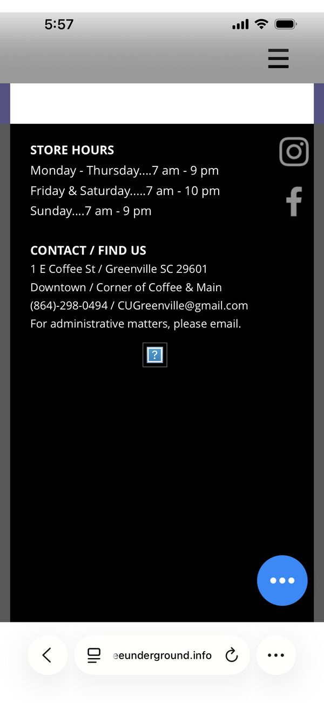
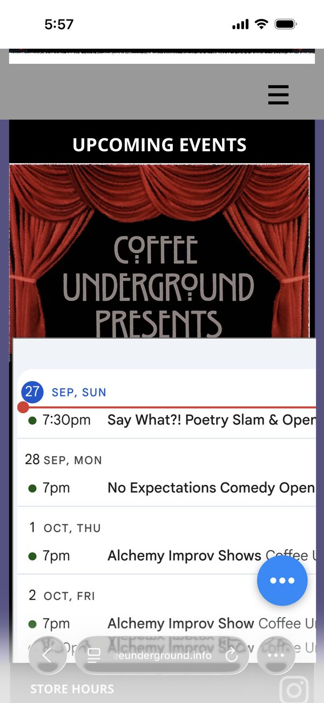
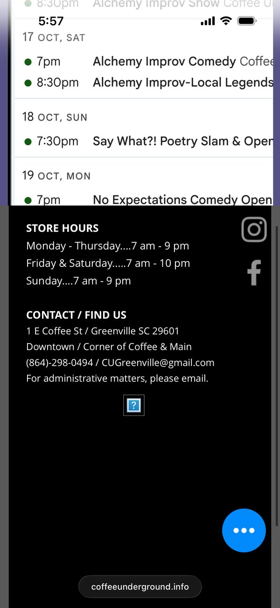
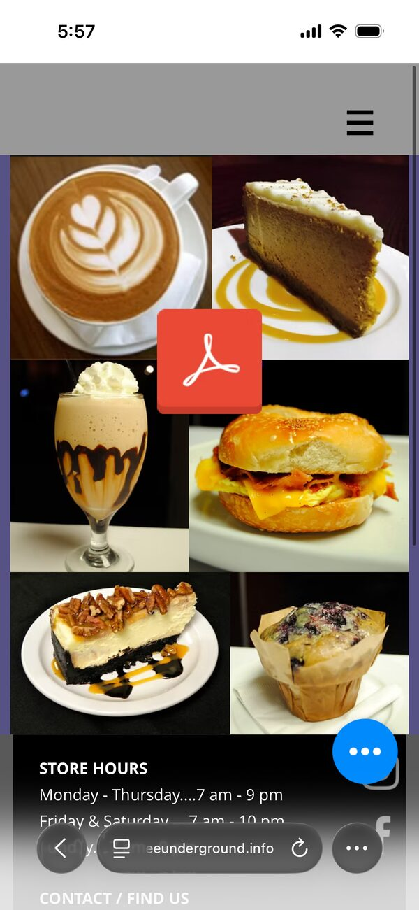
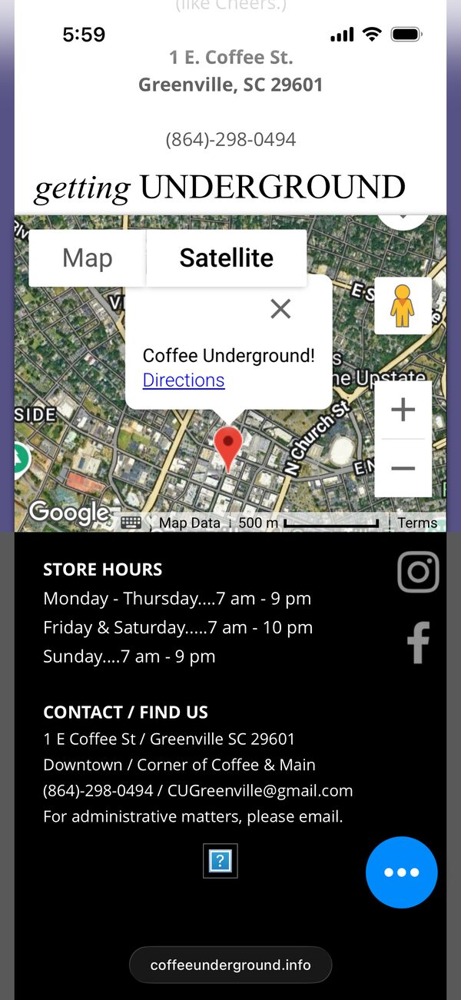

# Coffee Underground website redesign: what changed and why

September 27, 2026

All of the text and photos from the Wix site are still here, in your words. The only text changes are spelling and grammar fixes, and each one is listed near the end of this document.

The changes are about how the site works for visitors: on phones, for people who use screen readers or navigate by keyboard, and for anyone checking what's going on this week. Each item below says what visitors ran into, what's different now, and why that helps.

## At a glance

- The site fits any screen, from a small phone to a wide monitor.
- The full menu is readable on the page, not only as a PDF - PDF is still downloadable though!
- The Events page shows the next seven days from your Google Calendar and refreshes itself every morning automatically; there is also a new page dedicated to a full view of the calendar.
- Pages load faster, and the main content appears sooner.
- The site is easier to use with a keyboard or a screen reader.
- Old links to your pages still work.
- All of the written content and page titles are still your writing!

### Mobile Screenshots from Original Wix Site

<table>
  <tr>
    <td valign="top" width="220">
       
      <b>Home Page Broken on Mobile</b> 
      On mobile devices, home page content is not rendering and the user primarily just sees the chat button overlay.
    </td>
    <td valign="top" width="220">
       
      <b>Events</b> 
      On the events page, content is compacted, banner image is cropped, gray nav bar takes a lot of vertical space that could be used differently.
    </td>
    <td valign="top" width="220">
       
      <b>Footer - broken image</b> 
      The footer has a non-rendering image reference.
    </td>
  </tr>
  <tr>
    <td valign="top" width="220">
       
      <b>Menu Access</b> 
      Menu access requires leaving site to view PDF - visitor just sees an Adobe logo
    </td>
    <td valign="top" width="220">
       
      <b>Contact Page</b> 
      Google Map is embedded as an iframe that is zoomed out and cramped for mobile experience.
    </td>
    <td></td>
  </tr>
</table>

### What changed?

**Layout.** On phones, the original Wix site keeps its desktop layout and shrinks it, and content does not render properly. The new layout adjusts to the screen, so text uses the full width and stays readable. Most people look up a café on their phone, often while they're out deciding where to go.

**Chat button.** A chat bubble floated over the page on phones and covered text. It's gone now, and visitors reach you by phone or email instead, so nothing sits on top of what people are reading.

**Navigation.** Some pages were tucked under a "More..." item, which meant guessing where to look. All six pages are now listed plainly, and on small screens a Menu button opens the list. The menu, events and directions are each one tap away.

**Footer.** The footer took up a whole phone screen and ended with an image that didn't load. It's compact now: store hours in a small table, a phone number and email address you can tap, and links to Facebook and Instagram. Hours and contact details are what people look up most on a café site, so they should be quick to find.

**Instagram.** The footer showed an Instagram icon that didn't link anywhere. It now goes to instagram.com/coffee.underground on every page.

**Photos.** Wix showed most photos about 200 pixels wide, which is small on a phone and soft on a large screen. Photos now fill their space and stay sharp at any size.

## Finding and contacting the café

**Map.** The old map was a full Google Maps widget that loaded slowly, and a pop-up covered the pin. It's replaced by a lighter map in a card with three buttons: Directions (Google Maps), Apple Maps and Call. The "getting UNDERGROUND" directions sit next to it as two short steps. Someone standing on Main Street can get directions or call you with one tap.

**Contact form.** The message form only worked while the site was hosted on Wix. A "Send a message" button now opens a new email to cugreenville@gmail.com, so messages come straight to you and there's no form to maintain.

**Old links.** Page addresses match the Wix ones (/events, /menus, /about-cu, /coffee-facts, /contact), so links that people saved, shared or found through search still work.

## The menu

**Menu on the page.** The menu was only available as a PDF, and the Menus page showed five category photos without any items. The full menu is now on the page as text, grouped under your five categories (COFFEES, NO BUZZ, INDULGE, SWEETNESS, NOURISH), with a bar that jumps to each one. "Download Menu PDF" is still there. PDFs are hard to read on a phone, and many screen readers can't read them at all. Search engines can read the text menu too, so someone searching for "matcha Greenville" or "affogato near me" is more likely to find you.

**Current version.** The page follows the 7/10/25 PDF, which is the one your Menus page links to, rather than the older 3/29/24 menu. If the 3/29/24 file is still posted anywhere, it's worth taking down so it stops circulating.

**Menu spelling.** These are fixed on the web page: affogato, pinot noir, ménage à trois, marrakesh, and a missing space in "vodka, cran". The PDF itself hasn't changed and still has the old spellings.

## Events and the theater

**Upcoming events.** The "Upcoming events" section had two fixed descriptions, one for the poetry slam and one for the comedy open mic. They never changed, so cancellations, one-off shows, holiday hours and other regulars like Alchemy Improv and the Greenville Jazz Collective didn't show up. The section now lists the next seven days from your Google Calendar, grouped by day with start times. Each event shows the short note you put in the calendar's location field (price or admission), plus a "Details" link that opens the full description. The site checks the calendar every morning. You keep one calendar up to date and the website follows it, so nobody has to edit the site when a show changes.

**Full calendar.** The calendar sat in a fixed-size box that didn't scroll and was too wide for phones. It now has its own page that fills the screen, with buttons to open it full screen, add it to Google Calendar, or subscribe in Apple Calendar or Outlook. The Events page links to it. Regulars can put your shows in their own calendar and see changes automatically.

**Theater banner.** The top of the Events page was a photo with "COFFEE UNDERGROUND PRESENTS" painted into it, and "THEATER UNDERGROUND" placed over part of it on a black box. Since most of the heading was part of a picture, screen readers and search engines couldn't read it, and it couldn't adjust to different screen sizes. The banner is now a drawn stage, with red curtains gathered at the sides, a draped valance across the top and a soft spotlight, and "Coffee Underground presents THEATER underground" is real text in front of it. Everyone can read the heading, including search engines. It stays sharp at every size, and the page loads faster without the large photo.

## Faster pages

**Photo sizes.** Many photos were sent at full size even when shown small, and together they came to about 7.8 MB. They're now resized for the web, with nothing cropped, and total about 3.7 MB. Most pages download about half as much as before, which means faster loading on cell data and less of a visitor's data plan used up.

**Main images first.** On some pages the main image loaded last. In Google's standard phone test, the main content of the Coffee Facts page took about 5.6 seconds to appear. The main image on each page now loads first, and Coffee Facts appears in about 3.4 seconds in the same test. People tend to leave a page that still looks empty.

**Less jumping.** Pages used to shift as photos and fonts loaded, so text moved while people were reading or about to tap. Every photo now has its space reserved ahead of time, and the Events page no longer jumps when its fonts load. That means fewer mis-taps and less losing your place.

**Logo.** The small logo in the page header was a large file shown at a tiny size on every page. A small copy is used there now, and the full-size logo is kept for other uses.

## Accessibility

These changes help people who use screen readers, navigate by keyboard, or are sensitive to motion, and most of them make the site easier for everyone else too.

- A whole paragraph on the home page was marked up as a heading, and the About page skipped a heading level. Headings are now short and in order. Screen reader users move around a page by jumping between headings, so the outline needs to make sense.
- The events banner heading and the full menu are now real text. Screen readers can read them aloud, and visitors can zoom in without blur.
- Every link and button shows a clear outline when reached with the Tab key. A "Skip to content" link lets keyboard users go straight past the navigation.
- Text colors were checked against their backgrounds so words stay readable in bright light and for people with low vision.
- The home page intro doesn't play for visitors whose phone or computer is set to reduce motion.
- Buttons and links are big enough to tap easily.
- Google's Lighthouse tool scores every page 100 out of 100 for accessibility.

## Look and feel

**Home page intro.** The home page opens with a short line-drawing animation of a latte being poured, over a painted brick-and-pothos stairwell. The pour follows a natural curve. It lasts about three seconds, plays at most once every 30 days on a given phone or computer, and can be skipped with a tap or the Skip button. First-time visitors get the animation, and regulars aren't made to sit through it every visit.

**Decorative scroll image.** Next to the "Located at the corner of Coffee & Main" text on the home page, a tall, narrow purple scroll graphic took the spot where a main picture would usually go, and it was shown slightly stretched. That section is now a plain block of text. The graphic is saved in case you'd like to use it somewhere else.

**Mice on Main link.** The "Looking for Mice on Main?" line was near the top of the home page. At the moment, anyone who clicks through to miceonmain.com gets a security warning from their browser because of an expired certificate on that site. The line has moved further down, to the end of "Something for everyone", so the first link visitors see doesn't lead to a warning. The wording and the link are unchanged.

**Extras page.** The Extras page, linked from About, still had template text from the Wix editor: a browser tab titled "BLANKKKKKK", a heading that read "I'm a title. Click here to edit me", and a blank where a furniture store's name should be. The page isn't included in the new site, and the link to it on the About page is removed. Anyone who uses the old address (/blank) lands on the About page. The Cauble Building paragraph is saved and can come back once the store name is filled in.

**"Created with Wix.com".** This is removed from the footer. Your copyright line stays.

**Original photos.** The full-size originals of every photo, exactly as they were uploaded to Wix, are stored with the site files, so you'll always have them.

## Spelling and grammar fixes

Only clear typos and grammar slips were changed. Wording, tone and facts are as you wrote them.

- **Contact:** Risorante → Ristorante; "(like Cheers.)" → "(like Cheers)."; the phone number is written as (864) 298-0494.
- **About:** rennovated → renovated; hurricane Helene → Hurricane Helene; "I purchased the 5200 SF where CU still sits" → "I purchased the 5200 square feet of property where CU still sits".
- **Events:** "Open Mic The longest running comedy show" is split into a title, "No Expectations Comedy Open Mic", followed by "The longest-running comedy show...".
- **Coffee Facts:** Mocca → Mocha; hundred of years → hundreds of years; it's way → its way; alledgedly → allegedly; annonymously → anonymously; "Martinique to the by means of" → "Martinique by means of"; Ethiopis → Ethiopia; "integral part life" → "integral part of life"; hearty evergreens → hardy evergreens; "which coffee species used" and "which method used" → "is used"; pop corn → popcorn; In a Nut Shell → In a Nutshell; i.e. → e.g. where the lists are examples; Frangrance → Fragrance; "Spicy. Caramel" → "Spicy, Caramel"; chains stores → chain stores; ozygen → oxygen.
- **Menu:** see "Menu spelling" above.

## What we need from you

1. The weekly No Expectations Comedy entry in your Google Calendar starts at 7pm, but the show starts at 7:30pm. The entry's own description says 7:30pm, and so does visitgreenvillesc.com. The Events page shows whatever the calendar says, so changing that start time to 7:30pm fixes it everywhere.
2. If you'd like the Cauble Building history back on the site, we just need the furniture store's name.
3. The Alchemy section says "check out their classes page" but has no link. If you know the page, we'll add it.
4. Most photos had no captions on Wix, so several have general descriptions for screen readers. A few words about what's in each photo would help.
5. You may want to let Mice on Main know that their website shows a security warning.

## Before the new site goes live

Your web address, coffeeunderground.info, is managed through Wix right now. Moving the site is safe as long as your email settings stay in place.

The address has settings that route email through Google (Google Workspace). If you or your staff use any email address ending in @coffeeunderground.info, those settings are what deliver it. When the address is pointed at the new site, only the website settings change, and the email settings have to stay exactly as they are or that mail stops arriving. We'll switch the website over first and confirm that the new site loads at coffeeunderground.info and that mail still arrives. Only after that should the Wix plan be cancelled.

Two questions for you:

- Do you use any @coffeeunderground.info email addresses, or only cugreenville@gmail.com?
- Did you buy the coffeeunderground.info address through Wix, or somewhere else?
